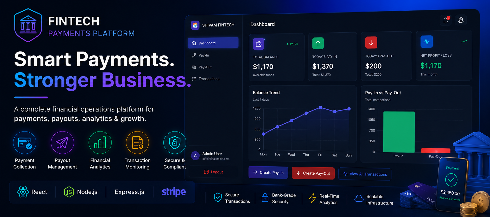
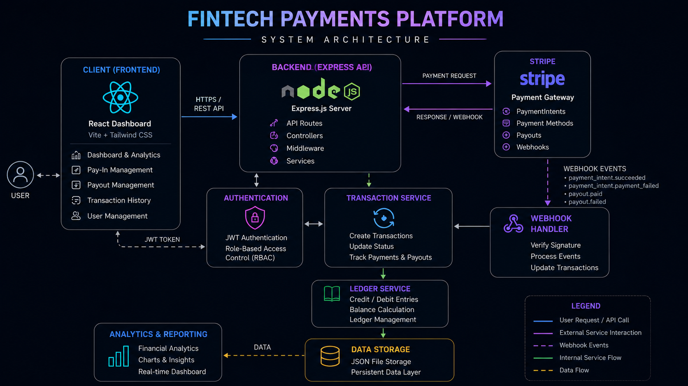
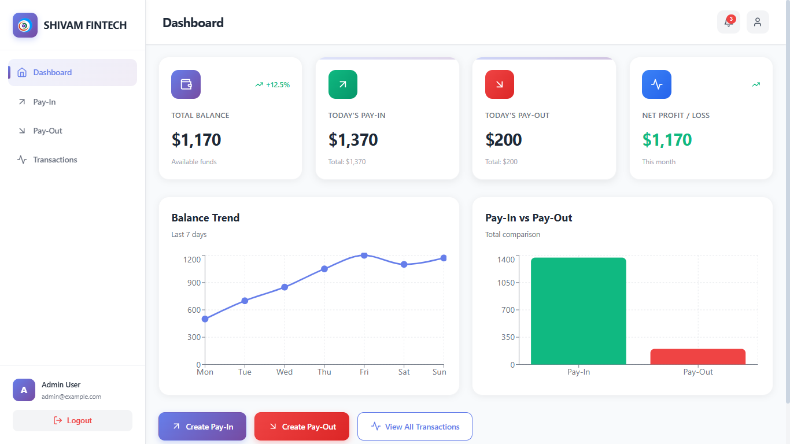
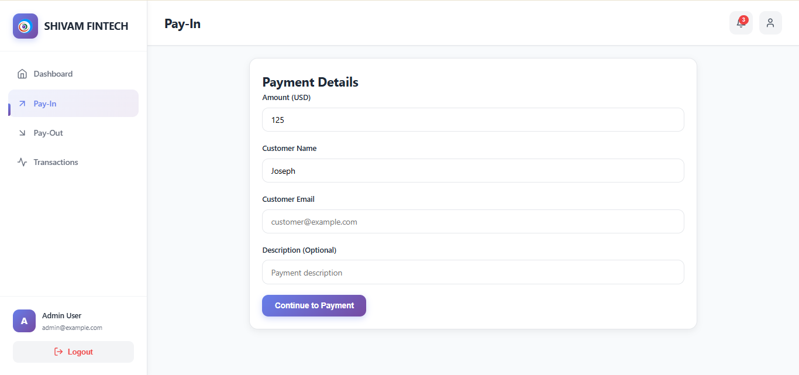
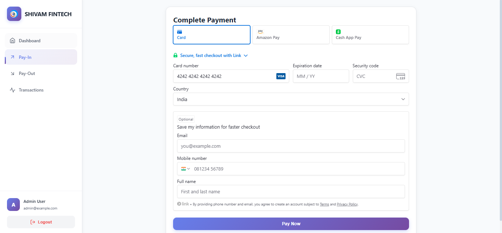
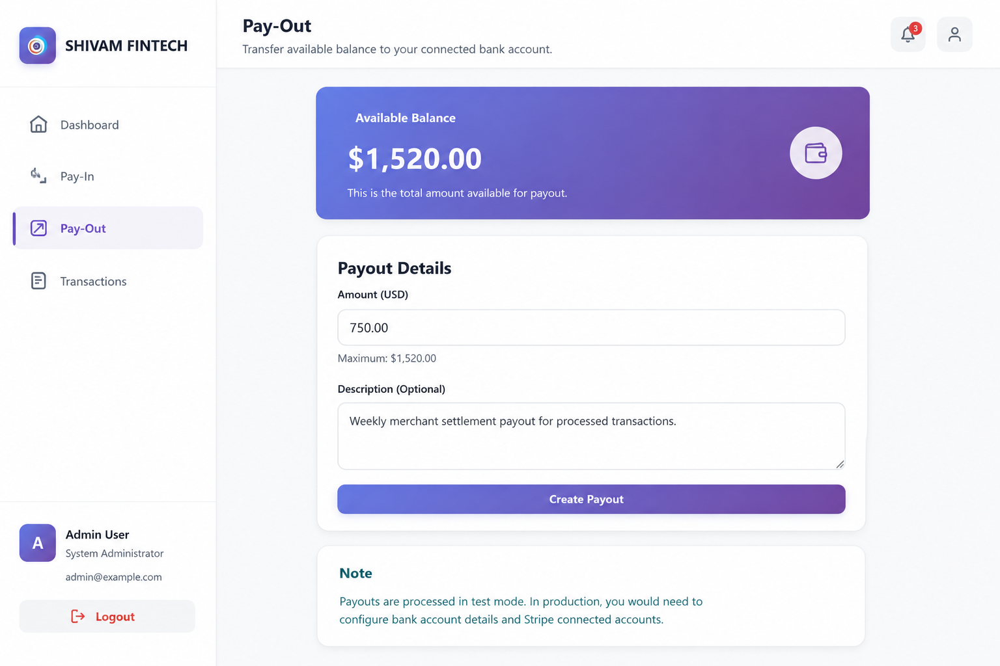
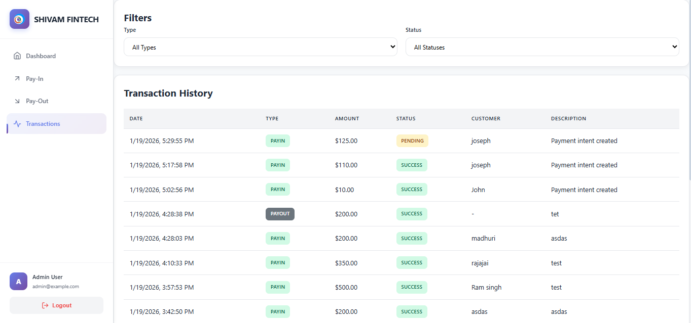
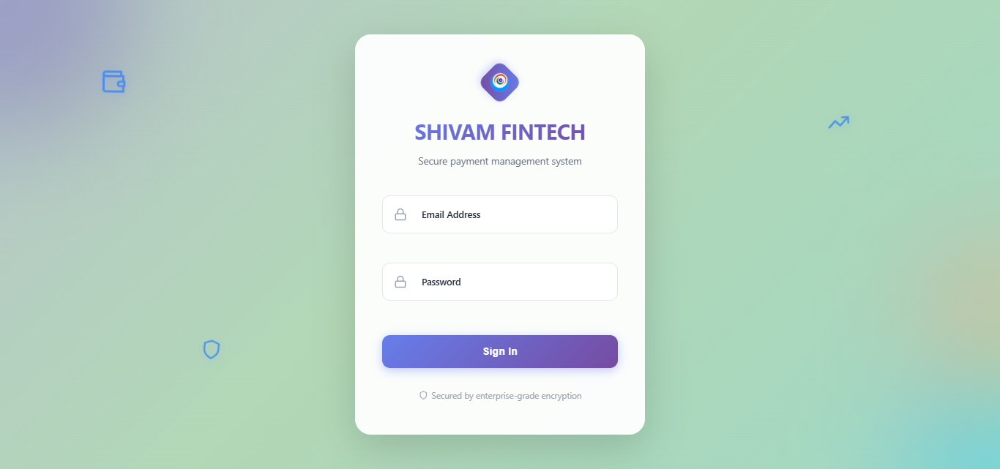

# 🏦 Fintech Payments Platform

Production-ready fintech platform for payment collection, payout management, transaction monitoring, financial analytics, and secure Stripe-powered payment processing.

---

  

  <strong>Secure Payment Processing • Payout Management • Financial Analytics • Transaction Monitoring</strong>

---

## 🌐 Live Platform

🌐 https://fintech.shivamitcs.in

---

# Platform Vision

Fintech Payments Platform is a modern financial operations ecosystem engineered to streamline digital payment collection, payout processing, transaction management, and financial reporting through a unified enterprise dashboard.

Designed with security, scalability, and operational efficiency in mind, the platform combines payment infrastructure, analytics, and financial workflows into a single experience.

---

# Platform Highlights

* Secure Payment Collection
* Payout Management
* Stripe Payment Processing
* Financial Analytics Dashboard
* Transaction Monitoring
* JWT Authentication
* Role-Based Access Control
* Stripe Webhooks
* Financial Ledger System
* Responsive SaaS Experience

---

# 👥 Role-Based Operational System

The platform provides isolated operational workflows for financial teams and business operations.

## Supported Roles

* Administrator
* Finance Manager
* Operations Staff
* Viewer

---

# Financial Operations Infrastructure

## Payment Collection Infrastructure

The platform enables secure payment collection through Stripe-powered workflows.

### Capabilities

* Stripe PaymentIntents
* Customer Payment Management
* Secure Card Processing
* Payment Confirmation
* Transaction Recording
* Real-Time Balance Updates

---

## Payout Infrastructure

Manage outgoing funds through secure payout workflows.

### Capabilities

* Balance Validation
* Payout Management
* Fund Transfer Processing
* Transaction Tracking
* Financial Controls
* Operational Visibility

---

## Transaction Infrastructure

Monitor and manage financial activities through centralized transaction systems.

### Capabilities

* Transaction Lifecycle Tracking
* Status Monitoring
* Customer Tracking
* Audit Logging
* Financial Reconciliation
* Operational Reporting

---

## Financial Ledger System

Maintain accurate financial records through ledger-based accounting workflows.

### Capabilities

* Credit Entries
* Debit Entries
* Balance Tracking
* Financial Reconciliation
* Audit Trail
* Transaction History

---

# Multi-Layer Architecture

The platform follows a modular architecture designed for scalability, maintainability, and secure financial operations.

### Architecture Layers

* Frontend Experience Layer
* API Layer
* Authentication Layer
* Payment Infrastructure Layer
* Transaction Processing Layer
* Ledger Management Layer
* Data Storage Layer

---

# Platform Features

* Real-Time Dashboard Analytics
* Secure Stripe Payment Processing
* Financial Reporting Infrastructure
* Transaction Monitoring
* Payout Management
* Ledger-Based Accounting
* JWT Authentication
* Role-Based Access Control
* Responsive SaaS Dashboard
* Modern User Experience

---

# Technology Stack

## Frontend Engineering

* React 18
* Vite
* Tailwind CSS
* Framer Motion
* Recharts
* Axios
* Stripe Elements

---

## Backend Infrastructure

* Node.js
* Express.js
* JWT Authentication
* bcryptjs
* Express Validator
* Stripe API
* Stripe Webhooks

---

## Financial Infrastructure

* Stripe PaymentIntents
* Stripe Payouts
* Webhook Processing
* Transaction Tracking
* Ledger Services

---

## Data Management

* File-Based JSON Storage
* Custom Storage Service
* Transaction Persistence
* Financial Records
* Ledger Tracking

---

# Architecture Highlights

- Layered financial architecture
- Stripe-powered payment infrastructure
- Role-based operational workflows
- Real-time transaction monitoring
- Ledger-based financial tracking
- Secure webhook processing

---

# System Architecture

  

The platform follows a layered financial architecture that separates frontend experiences, backend services, authentication, payment processing, webhook handling, transaction management, ledger operations, and data persistence into independent components.

---

# Platform Preview

Modern financial workflows engineered for businesses requiring secure payment processing, payout management, transaction monitoring, and financial visibility.

The platform delivers enterprise-grade financial infrastructure through real-time analytics, transaction intelligence, secure payment processing, and operational reporting.

---

# 🌐 Web Platform Screenshots

### 📊 Financial Dashboard

  

---

### 💳 Payment Collection

  

---

### 🔐 Secure Stripe Checkout

  

---

### 💸 Payout Management

  

---

### 📑 Transaction Monitoring

  

---

### 👤 Authentication Portal

  

---

# 🔐 Security Architecture

Financial systems require enterprise-grade operational security.

The platform includes:

* JWT Authentication
* Role-Based Access Control (RBAC)
* Password Hashing
* Protected APIs
* Stripe Webhook Verification
* Input Validation
* Secure Environment Configuration

---

# ⚡ Scalability Engineering

The platform is engineered for scalable financial operations.

## Scalability Features

* Modular Architecture
* Service-Oriented Design
* API-Driven Infrastructure
* Independent Payment Processing
* Transaction Lifecycle Management
* Extensible Data Layer
* Future Database Migration Support

---

# Business Problem

Organizations often manage incoming payments, outgoing transfers, and transaction records across multiple disconnected systems.

This creates:

* Limited financial visibility
* Operational inefficiencies
* Manual reconciliation challenges
* Reporting complexity
* Increased risk of financial errors

Modern businesses require centralized financial infrastructure capable of handling payment operations securely and efficiently.

---

# Business Outcomes

- Improved financial visibility
- Reduced reconciliation effort
- Faster payment processing workflows
- Centralized transaction management
- Enhanced operational control
- Secure financial operations

---

# Key Use Cases

- Payment collection platforms
- Merchant payment systems
- Internal finance operations
- Payout management platforms
- Transaction monitoring systems
- Financial reporting dashboards
- Stripe-powered SaaS applications

---

# Solution

The Fintech Payments Platform centralizes financial operations into a unified dashboard.

The platform enables:

* Payment Collection
* Payout Processing
* Transaction Management
* Balance Monitoring
* Financial Reporting
* Real-Time Analytics
* Secure Financial Operations

All within a modern enterprise-grade financial operations ecosystem.

---

# Platform Focus Areas

* Fintech Platforms
* Payment Processing Systems
* Financial Operations
* Transaction Management
* Financial Analytics
* SaaS Applications
* Stripe Integrations
* Financial Infrastructure

---

# Product Roadmap

## Phase 1 — Payments Foundation

* Payment Collection
* Payout Processing
* Authentication Infrastructure
* Dashboard Analytics

---

## Phase 2 — Financial Operations

* Advanced Reporting
* Transaction Intelligence
* Enhanced Ledger Services
* Financial Monitoring

---

## Phase 3 — Enterprise Scaling

* Multi-Organization Support
* Advanced Permissions
* Operational Automation
* Enhanced Analytics

---

## Phase 4 — Intelligent Financial Platform

* AI Financial Insights
* Predictive Analytics
* Automated Reconciliation
* Intelligent Financial Operations

---

# Deployment Infrastructure

* Production Deployment
* Environment-Based Configuration
* Secure Secrets Management
* Stripe Integration
* Webhook Infrastructure
* Continuous Deployment Ready
* Webhook Event Processing

---

# Engineering Vision

The Fintech Payments Platform represents a modern financial operations ecosystem engineered for secure payment processing, transaction visibility, financial intelligence, and scalable business operations.

Designed with an enterprise engineering mindset, the platform focuses on operational efficiency, financial transparency, secure payment workflows, and future-ready financial infrastructure.

---

# Why This Platform Exists

Businesses require secure and centralized financial infrastructure capable of handling payments, payouts, transaction monitoring, and reporting efficiently.

The platform was developed to unify financial operations into one modern enterprise-grade experience that simplifies financial management while maintaining security, transparency, and scalability.

---

# 📄 License

MIT License

Copyright © 2026 SHIVAM ITCS
